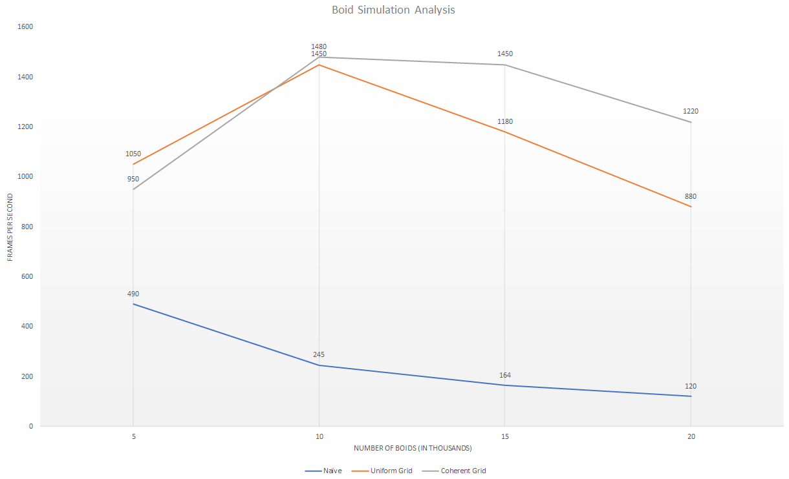

Project 1 Flocking
====================

**University of Pennsylvania, CIS 565: GPU Programming and Architecture, Project 0**

**Anantha Srinivas**
[LinkedIn](https://www.linkedin.com/in/anantha-srinivas-00198958/), [Twitter](https://twitter.com/an2tha)

**Tested on:**
* Windows 10, i7-8700 @ 3.20GHz 16GB, GTX 1080 8097MB (Personal)
* Built for Visual Studio 2017 using the v140 toolkit

Implementation
---

This is the simulation running on 100K boids at 350 Frames per second. This shows semi-coherent memory access uniform grid flocking.

---

__Performance Graph__

